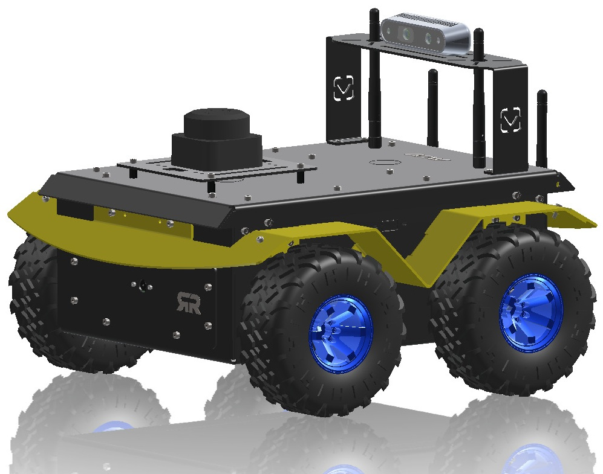

# Introduction



### 💰 Pricing & Availability

| Configuration                       | Price (USD) | Price (INR) |
| ----------------------------------- | ----------- | ----------- |
| BeetleBot Standard (LiDAR + Camera) | On Request  | On Request  |
| BeetleBot Pro (+ Depth Camera)      | On Request  | On Request  |

**Available for worldwide shipping.**\
📧 Sales enquiry: <sales@veerobot.com>\
🛒 Contact today: [veerobot.com/contact](https://veerobot.com/index.php?route=information/contact)\
📞 India: +91-9008-177-577

### Overview

**Beetlebot** is a professional-grade mobile robotics platform designed for research, education, and autonomous navigation development. Built by **VEEROBOT®** (a Siliris product), Beetlebot combines industrial-strength hardware with the flexibility of ROS2 Jazzy, making it ideal for universities, research labs, and robotics enthusiasts who need a serious platform.

Unlike toy-grade robots, Beetlebot features rugged aluminum construction, high-torque metal gear motors, and a comprehensive sensor suite - delivering the capability of platforms like Clearpath Husky at a fraction of the cost.

***

### What Makes Beetlebot Special?

#### 🏗️ **Industrial-Grade Construction**

* Powder-coated aluminum chassis (not plastic)
* Rugged design for indoor and outdoor use
* Metal gear motors (JGB37-3530) rated for continuous operation
* Professional cable management and component mounting

#### 🧠 **Powered by ROS2 Jazzy**

* Full ROS2 Jazzy Jalisco integration
* Complete Navigation2 (Nav2) stack
* SLAM Toolbox for mapping
* Gazebo Harmonic simulation support
* URDF models with accurate physics

#### 🎯 **Research-Ready Sensor Suite**

* **RPLidar C1** - 360° laser scanning, 12m range
* **Raspberry Pi Camera V1.3** - 5MP imaging
* **LSM6DSRTR IMU** - 6-axis motion sensing (accelerometer + gyroscope)
* **Quadrature Encoders** - 3600 ticks/revolution per wheel
* **Battery Monitoring** - Real-time voltage tracking

#### 🚀 **Powerful Compute Platform**

* **Raspberry Pi 5** (8GB RAM) - Main ROS2 brain
* **STM32F405** (Lyra controller) - Real-time motor control
* **168 MHz Cortex-M4F** - Deterministic motor control at 20Hz
* **FreeRTOS** - Multi-threaded firmware for reliability

#### 🎮 **Ready Out of the Box**

* Pre-installed ROS2 Jazzy on Ubuntu 24.04
* All packages built and configured
* Auto-start joystick control on boot
* Wireless controller included (Cosmic Byte Nexus)

***

### Key Applications

Beetlebot is designed for:

✅ **Academic Research** - Publish papers, test algorithms, conduct experiments\
✅ **Robotics Education** - Teach autonomous systems, computer vision, SLAM\
✅ **Algorithm Development** - Test navigation, planning, perception algorithms\
✅ **Prototype Development** - Rapid prototyping of mobile robot applications\
✅ **Competitions** - Robotics competitions requiring autonomous navigation

***

### Technical Highlights

| Category               | Specification                              |
| ---------------------- | ------------------------------------------ |
| **Dimensions (L×W×H)** | 375mm × 360mm × 245mm                      |
| **Weight**             | \~2.2 kg (with battery)                    |
| **Payload**            | 1 kg                                       |
| **Drive Type**         | 4-Wheel Skid-Steer Drive                   |
| **Max Speed**          | 1.0 m/s (3.6 km/h)                         |
| **Battery**            | 3S Li-Ion 11.1V 10Ah (3S4P, 2500mAh cells) |
| **Runtime**            | 5-6 hours typical use                      |
| **Ground Clearance**   | 16.3 cm                                    |
| **Operating Temp**     | 15-40°C                                    |
| **Compute**            | Raspberry Pi 5 (8GB) + STM32F405           |
| **Communication**      | WiFi 6 (2.4/5GHz), Ethernet, UART          |

***

### What's Inside?

\[PLACEHOLDER: System architecture diagram]

#### Hardware Architecture

```
┌─────────────────────────────────────────┐
│   Laptop/PC (Optional)                  │
│   • RViz Visualization                  │
│   • Gazebo Simulation                   │
│   • Remote Development                  │
└────────────┬────────────────────────────┘
             │ WiFi / Ethernet
             ▼
┌─────────────────────────────────────────┐
│   Raspberry Pi 5 (ROS2 Brain)           │
│   • Navigation Stack (Nav2)             │
│   • SLAM Mapping (SLAM Toolbox)         │
│   • Sensor Fusion (EKF)                 │
│   • Joystick Control                    │
└─────┬───────────────────────┬─────────┬─┘
      │                       │         │
   UART3                     USB       USB
      │                       │         │
      ▼                       ▼         ▼
┌────────────────────── ┐  ┌────────┐ ┌─────────┐
│ Lyra STM              │  │ Camera │ │  LiDAR  │
│ F405                  │  │  V1.3  │ │   C1    │
│                       │  └────────┘ └─────────┘
│ • 4 Motors (JGB37-3530)
│ • 4 Encoders (900 CPR → 3600 ticks/wheel rev)
│ • IMU (LSM6DSRTR)
│ • Battery Monitor
└────────────────────────┘
```

#### The Lyra Controller

**What is Lyra?**\
Lyra is the STM32-based motor controller board inside Beetlebot. It handles all real-time motor control, sensor reading, and safety monitoring - leaving the Raspberry Pi free to focus on higher-level navigation and planning.

**Why separate controller?**\
Linux (on the Pi) is not real-time. The Lyra controller runs FreeRTOS, providing deterministic 20Hz motor control loops with microsecond precision - essential for smooth, accurate motion.

**Key Features:**

* 20Hz PID control loop per motor
* Binary communication protocol (10Hz telemetry)
* Multi-layer safety system (watchdog, timeouts, fault detection)
* Flash-based configuration storage
* USB and UART interfaces

***

### What's in the Box

When you receive your Beetlebot, you'll find:

✅ **Beetlebot Robot** - Fully assembled and tested\
✅ **3S Li-Ion Battery** (11.1V, 10Ah) with BMS - Pre-installed\
✅ **12V 2A Smart Charger** with 2.1mm jack\
✅ **Wireless Controller** (Cosmic Byte Nexus) with USB RF dongle\
✅ **RPLidar C1** - Pre-mounted on top plate\
✅ **Raspberry Pi Camera V1.3** - Pre-installed\
✅ **Optional Depth Camera Mount** - Metal bracket for depth camera (in box, not mounted)\
✅ **Rugged Transport Case** - Protective storage\
✅ **WiFi Antenna** - External antenna for extended range\
✅ **Charging Cable** and USB cables\
✅ **Documentation QR Code** - Access to this online manual

**Not Included:**

* Laptop or PC (required for development and visualization)
* Depth camera (mount included, camera sold separately if required)
* HDMI monitor (optional, for direct Pi access)

***

### Physical Features

\[PLACEHOLDER: Top-down view photo showing layout]

#### Front Panel

* **Raspberry Pi Camera** - 5MP camera facing forward at 8.8cm height

#### Top Plate

* **RPLidar C1** - Mounted at 20.6cm height, centered front
* **Acrylic Platform** - 3mm transparent plate for mounting accessories
* **Depth Camera Mount** - Optional metal bracket at rear

#### Back Panel

\[PLACEHOLDER: Back panel photo showing all connectors]

* **RJ45 Ethernet Port** - Direct connection to Raspberry Pi
* **Power Switch** - Main power ON/OFF (red LED indicator when ON)
* **Reset Button** - Tactile button (raised button) - restarts Raspberry Pi
* **Charging Port** - 2.1mm center-positive jack (12V 2A)
* **OLED Display** - *Optional feature - may not be present on all units*

#### Side Panels

* **USB Connector Slot** - RF dongle for wireless controller (removable)
* **USB/HDMI Placeholder** - Access point for additional connectors (not populated)

#### Wheels

* **4× Rubber Wheels** - 130mm diameter with aggressive tread
* **Blue Hubs** - Color-coded for easy identification
* **All-Terrain** - Suitable for indoor floors and outdoor pavement

***

### Safety Warnings ⚠️

**READ BEFORE OPERATING**

#### Battery Safety

* ❌ **Never** charge battery unattended
* ❌ **Never** use damaged or swollen battery
* ❌ **Never** short-circuit battery terminals
* ❌ **Never** expose battery to temperatures >40°C
* ✅ **Always** use included 12V 2A charger only
* ✅ **Always** charge for 8 hours on first use
* ✅ **Always** inspect battery regularly for damage

**Battery Management System (BMS) Protection:**

* Under-voltage cutoff: 9.3V (3.1V per cell)
* Over-voltage protection: 12.6V (4.2V per cell)
* Short-circuit protection: Automatic

#### Operation Safety

* ❌ **Never** operate near stairs or ledges
* ❌ **Never** operate in water or wet conditions
* ❌ **Never** leave robot unattended when powered on
* ❌ **Never** operate with damaged wiring
* ✅ **Always** supervise robot operation
* ✅ **Always** keep clear of moving parts
* ✅ **Always** use on flat, stable surfaces during learning
* ✅ **Always** hold joystick deadman button (LB) for motion

#### Charging Safety

* Charge in well-ventilated area
* Place on non-flammable surface during charging
* Charger LED: **Red = Charging**, **Green = Full**
* Charging time: 4 hours normal, 8 hours first use
* Can charge while powered OFF or ON (charger is smart)
* May stop at 12.4-12.5V (normal) - charge for full 4 hours

#### Environmental Limits

* **Operating Temperature:** 15-40°C (59-104°F)
* **Storage Temperature:** 0-35°C (32-95°F)
* **Humidity:** <80% RH (non-condensing)
* **Terrain:** Flat floors, low-pile carpet, outdoor pavement
* **Obstacles:** Can climb \~1-2cm thresholds

***

### Performance Specifications

#### Motion Capabilities

* **Maximum Speed:** 1.0 m/s (safe indoor speed)
* **Typical Operating Speed:** 0.3-0.5 m/s (during mapping/navigation)
* **Turning Radius:** In-place rotation (0 radius)
* **Acceleration:** Smooth ramping (5 RPM/cycle limit, `MAX_RPM_STEP_PER_CYCLE` in firmware)
* **Ground Clearance:** 16.3 cm
* **Obstacle Climbing:** \~1-2 cm thresholds

#### Sensor Performance

* **LiDAR Range:** 12m maximum, 8-10m practical indoors
* **LiDAR Scan Rate:** 10 Hz (8000 samples/second)
* **Camera Resolution:** 5MP (2592×1944), 30fps @ 1080p
* **IMU Update Rate:** 100 Hz
* **Encoder Resolution:** 3600 ticks/revolution (900 CPR × X4 quadrature)
* **Odometry Accuracy:** ±3-5% linear, ±5-10% angular (wheel-only)

#### Power & Runtime

* **Battery Capacity:** 10Ah (11.1V nominal)
* **Runtime:** 5-6 hours typical mixed use
* **Continuous Operation:** \~1 hour tested
* **Charging Time:** 4 hours (8 hours first use)
* **Voltage Range:** 9.3V (cutoff) to 12.6V (full)
* **Power Consumption:** \~10-15W typical, \~30W peak

#### Navigation Performance

* **Mapping Resolution:** 5cm per pixel (typical)
* **Localization Accuracy:** <10cm with good map
* **Obstacle Avoidance:** 10-15cm safety margin
* **Navigation Success Rate:** \~80% in structured environments
* **Path Planning:** Global + local planning with dynamic obstacle avoidance

#### Communication

* **WiFi Range:** -37 to -40 dBm (excellent with external antenna)
* **Controller Range:** \~30-40m line-of-sight
* **ROS2 DDS:** Multi-machine support over WiFi
* **Ethernet:** Gigabit available via rear RJ45 port

***

### Learning Path

Beetlebot comes with comprehensive tutorials designed to take you from beginner to autonomous navigation expert:

#### 🟢 **Beginner** (Start Here)

1. **Hardware Familiarization** - Understand your robot
2. **ROS2 Communication & Tools** - Master ROS2 basics
3. **Robot Simulation** - Practice in Gazebo before real robot

#### 🟡 **Intermediate**

4. **Sensor Data Visualization** - Work with LiDAR, camera, IMU
5. **IMU Signal Processing** - Filter noisy sensor data
6. **Teleoperation Control** - Drive and understand kinematics
7. **Sensor Fusion** - Combine wheel odometry + IMU with EKF

#### 🔴 **Advanced**

8. **SLAM Mapping** - Build maps of your environment
9. **Computer Vision** - Extract information from camera
10. **Localization** - Know where you are on the map
11. **Autonomous Navigation** - Full self-driving capability

**Estimated Learning Time:** 40-60 hours total for complete mastery

***

### System Requirements

#### For Robot Development

* **Laptop/PC Required:** Ubuntu 22.04 or 24.04 (Preferred) (ROS2 Jazzy compatible)
* **RAM:** 8GB minimum, 16GB recommended
* **Storage:** 20GB free space for ROS2 installation
* **Network:** WiFi or Ethernet for robot communication
* **Optional:** External monitor/keyboard for direct Pi access

#### Included with Robot

* **Raspberry Pi 5** (8GB) - Pre-configured with:
  * Ubuntu 24.04 Server (64-bit ARM)
  * ROS2 Jazzy Jalisco (pre-installed)
  * All Beetlebot packages (built and tested)
  * Auto-start script (joystick enabled on boot)

#### Network Setup Required

* WiFi network with internet access
* Static IP configuration (guided setup)
* SSH access enabled (pre-configured)

***

### Support & Resources

#### Getting Help

**Documentation:** <https://docs.veerobot.com\\>
**Technical Support:** <support@veerobot.com>\
**Source Code:** GitHub (link provided on request)

#### Warranty

* **Hardware:** 12 months from purchase date
* **Battery:** 6 months or 300 charge cycles (whichever comes first)
* **Software Updates:** Provided free via GitHub

**Warranty does NOT cover:**

* Physical damage from drops, crashes, or misuse
* Water damage
* Unauthorized modifications / Tampering
* Electronics misuse or short circuit
* Battery damage from improper charging

#### Before Contacting Support

Please have ready:

* Robot serial number (if applicable - sticker on bottom)
* Detailed description of issue
* What you've tried already
* Error messages or logs
* Photos/videos of the problem (helpful!)

***

### Next Steps

#### 🚀 **New Users - Start Here:**

1. **Read Safety Warnings** (above) - Important!
2. **Unbox and Inspect** → Getting Started
3. **System Setup** → Setup Guide
4. **First Drive** → Hardware Familiarization

#### 🔧 **Ready to Configure:**

→ Continue to System Setup Guide

#### 📚 **Ready to Learn:**

→ Jump to Learning Robotics with Beetlebot

***

### About VEEROBOT®

Beetlebot is designed and manufactured by **VEEROBOT®**, a robotics division of **Siliris** Technologies Private Limited. Our mission is to make professional-grade robotics accessible to researchers, educators, and innovators worldwide.

**Quality Promise:**

* Industrial-grade components
* Rigorous testing before shipping
* Comprehensive documentation
* Responsive technical support
* Open-source software stack

***

**Ready to start your robotics journey?** → Continue to Getting Started

***

*Last Updated: January 2026*\
*Documentation Version: 1.0*\
*Compatible with: Beetlebot Hardware v1.1, Firmware 2025.11.05, ROS2 Jazzy*
