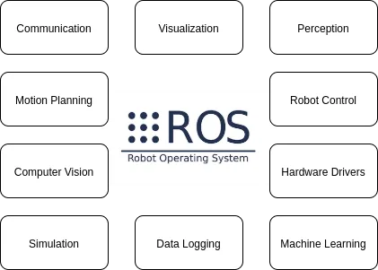

# Getting Started with ROS 2

Since ROS was started in 2007, a lot has changed in the robotics and ROS community. ROS 2 is built on the success of ROS 1, which is used today in myriad robotics applications around the world and improves greatly on some of the limitations of ROS 1. It provides the robotics tools, libraries, and capabilities that you need to develop your applications, allowing you to spend your time on the work that is important for your business. Because it is open source, you have the flexibility to decide where and how to use ROS 2, as well as the freedom to customise it for your needs.

ROS 1 was mostly used in academic projects while ROS 2 was developed so that it can be used in commercial projects too. The biggest change that came with ROS 2 was the selection of the DDS middleware for the communication layer. The DDS middleware, which has proven its worth in defence industry projects, has strengthened the communication between robot components with its decentralized publish subscribe architecture. Since ROS 2 is open source, related companies have also offered DDS libraries as open source to the sector. At the same time, ROS 2 has found a wider area of use with multi-robot communication, real-time communication and different platform support.

More information on ROS 2 (Foxy Version) can be found in the following pages:

[https://docs.ros.org/en/foxy/index.html](https://docs.ros.org/en/foxy/index.html)

### ROS 2 content

