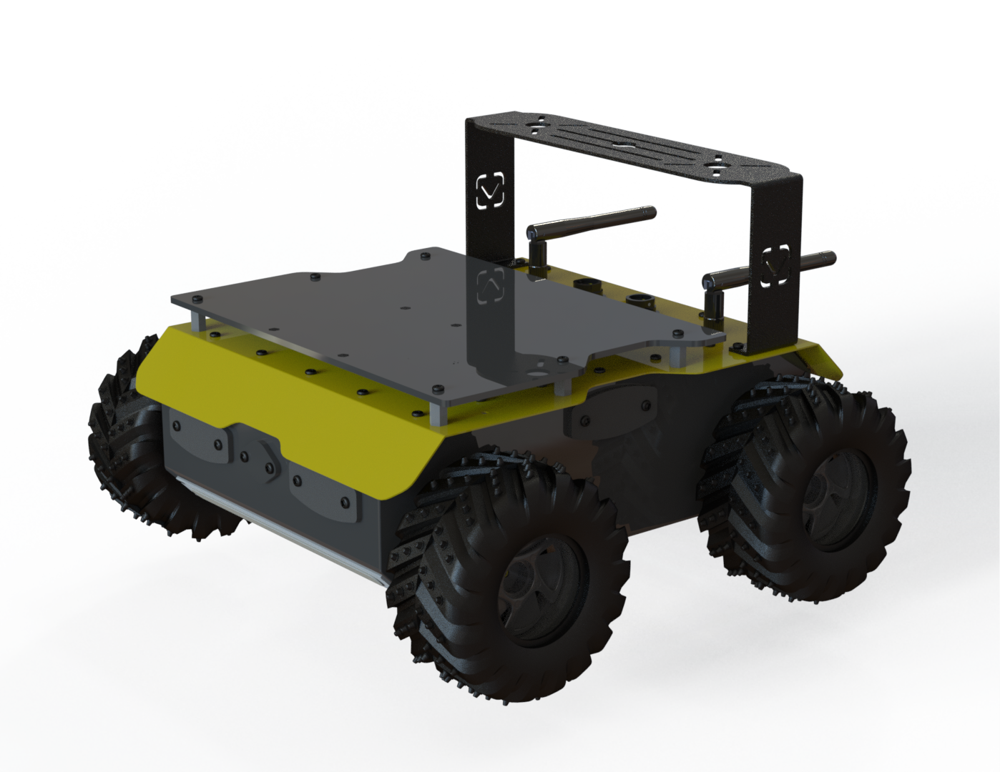
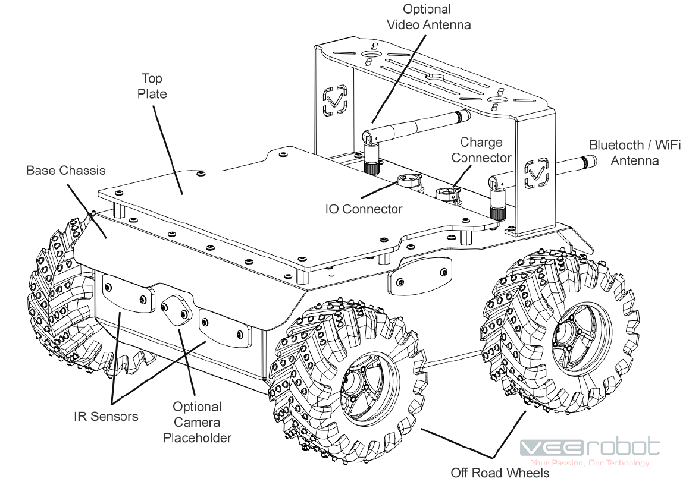
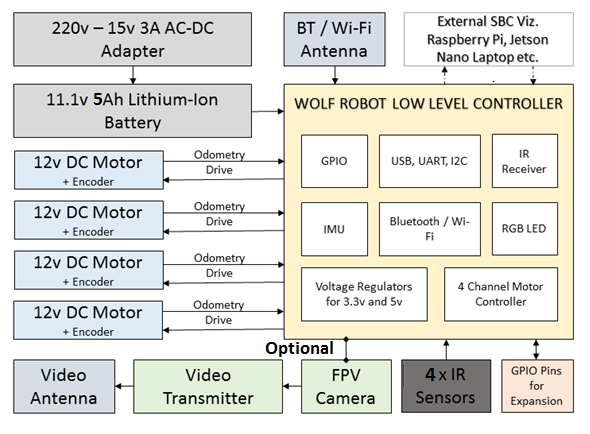

# Introduction to Wolf Robot

Wolf is a rugged and lightweight robot platform designed to be used as an easy-to-use unmanned ground vehicle for research and development presented by VEEROBOT®, a Siliris product.

Wolf includes a standard micro-controller board along with a motor controller to control 4 Motors. It is further extended using external controllers like a Raspberry Pi, Jetson Nano depending on the user requirement. The robot is ROS 2 compatible and can be controlled either with a Joystick, or commands from a PC or Laptop.

> [!NOTE]
> Note: Please read the complete manual before operating the Robot. Wrong connections, incorrect wiring can lead to damage of the internal controller / motors / batteries.

## Box Contents

* Wolf Robot – Fully Assembled
* Lithium Ion Battery pack with BMS
* 220v Universal Charger with 15v Output
* Sony / Compatible PS3 Bluetooth Controller
* LiDar Module
* Support plate to holder additional Sensors & Modules
* Charging and USB Connector
* 4 Outdoor Wheels
* Rugged Box to hold the Robot
* Antenna
* Metal Holder for External 3D Camera
* User Manual

## What is inside the Robot?

The robot is assembled in the factory and ready to use right out of the box.

#### Features and specifications - Outside:

* Aluminium Powder Coated Chassis
* Acrylic 3mm Top Plate to Hold Sensors, LiDar and other Modules
* Black Aluminium bracket to hold any additional 3D Cameras
* Four Wheels with Rubber Tyres for both indoor and Outdoor use
* Complete water resistant design
* LiDar with Connector

#### Features and specifications - Inside:

* ESP32 based Micro-Controller board to interface with ROS Platform
* Four Motor Controller Setup to control motors individually
* Raspberry Pi 4 with ROS 2 installed and setup
* Raspberry Pi Camera connected to Pi
* Four Infrared Sharp Sensors connected to Micro-controller board
* 12v Lithium Ion Battery with built in Battery Management System
* Voltage Regulator Modules to power Pi, Micro-controller and Motors
* Encoders on all motors for precision driving
* Power switch with LED indicator
* MOSFET controller to control power
* Extension Plate to mount all components
* Modular Wires, Cables and Extensions
* Heat Sink and Fans to Control the Temperature on boards
* Micro SD Card on Raspberry Pi with Ubuntu, ROS 2 systems installed
* USB Serial Connection between Raspberry Pi and Micro-Controller Board

### Wolf System Architecture

Wolf has a robust controller which is built around a feature rich capable MCU with integrated Wi-Fi and Bluetooth connectivity for a wide range of applications. The block diagram shows how the controller is connected to peripherals.

